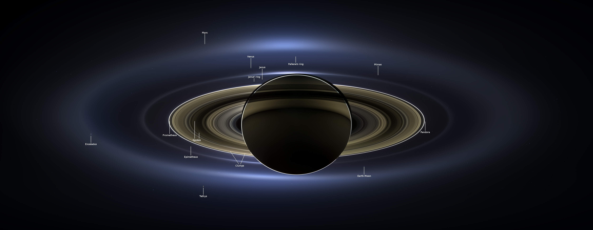

# Triumph at Saturn

By [NASA Jet Propulsion Laboratory](https://www.youtube.com/user/JPLnews)  

**Triumph at Saturn** （暂译：土星上的胜利）是由 [NASA Jet Propulsion Laboratory](https://www.youtube.com/user/JPLnews) 制作的关于卡西尼任务的最新纪录片，共 2 集。它是 “JPL and the Space Age”  系列的一部分。这个纪录片系列将会使用罕见的档案片段，记录下工程师和科学家作为先驱，向着宇宙探索踏出人类的众多“第一步”。

第一集于 2021 年 10 月 15 日播放，第二集于 10 月 23 日播出。

卡西尼-惠更斯号（Cassini–Huygens）是前往土星系统的一架旗舰级空间探测器，也是由美国宇航局（NASA）、欧洲空间局（ESA）和意大利航天局（ASI）合作进行的任务[7]。整个任务分为两部分：环绕土星的卡西尼号（Cassini）与在土星最大卫星土卫六登陆的惠更斯号（Huygens）。两具探测器由泰坦四号B型运载火箭搭载，于1997年10月15日一同发射升空，并于2004年7月初抵达土星轨道，随后在同年12月25日分离。卡西尼号自入轨后持续运作超过13年，直到2017年9月15日进入土星大气层焚毁；惠更斯号则于2005年1月14日成功于土卫六的阿迪立地区着陆并传回数据，是首具在外太阳系天体完成登陆的探测器。[——来自 Wiki](https://zh.wikipedia.org/wiki/%E5%8D%A1%E8%A5%BF%E5%B0%BC-%E6%83%A0%E6%9B%B4%E6%96%AF%E5%8F%B7)

终章落幕，探索不息。向卡西尼-惠更斯号致敬。

## LICENSE

视频和英文字幕的版权属于 [NASA Jet Propulsion Laboratory](https://www.youtube.com/user/JPLnews)

中文字幕采用[知识共享署名-非商业性使用-相同方式共享 4.0 国际许可协议](https://creativecommons.org/licenses/by-nc-sa/4.0/)进行许可。（仅为个人翻译练习，不对准确性做出任何保证，不允许用于商业目的）

## Subtitles

欢迎对中文字幕翻译提出问题和建议。

中文渣翻/特效字幕/时间轴：[*this](https://github.com/ClausewitzCPU0)

校对：暂无

## Part I

[Youtube](https://www.youtube.com/watch?v=SY-hQJ5pMd4)

## Part II

[Youtube](https://www.youtube.com/watch?v=oGsajLIALJE)

- TODO

## References

[Cassini–Huygens](https://en.wikipedia.org/wiki/Cassini%E2%80%93Huygens)

[Saturn](https://en.wikipedia.org/wiki/Saturn)

[卡西尼-惠更斯号 Wiki](https://zh.wikipedia.org/wiki/%E5%8D%A1%E8%A5%BF%E5%B0%BC-%E6%83%A0%E6%9B%B4%E6%96%AF%E5%8F%B7)

[Flagship Program](https://zh.wikipedia.org/wiki/%E6%97%97%E8%89%A6%E4%BB%BB%E5%8B%99)

https://www.google.com/doodles/cassini-spacecraft-dives-between-saturn-and-its-rings?hl=zh-CN

[Kingdom of Saturn](https://www.bilibili.com/bangumi/media/md28220408/) 

[BBC地平线：再见卡西尼号 你好土星](https://www.bilibili.com/bangumi/media/md28220182)

[The Images You Likely Haven't Seen of Cassini's Grand Finale](https://www.youtube.com/watch?v=8D6UWHZ_HYs)